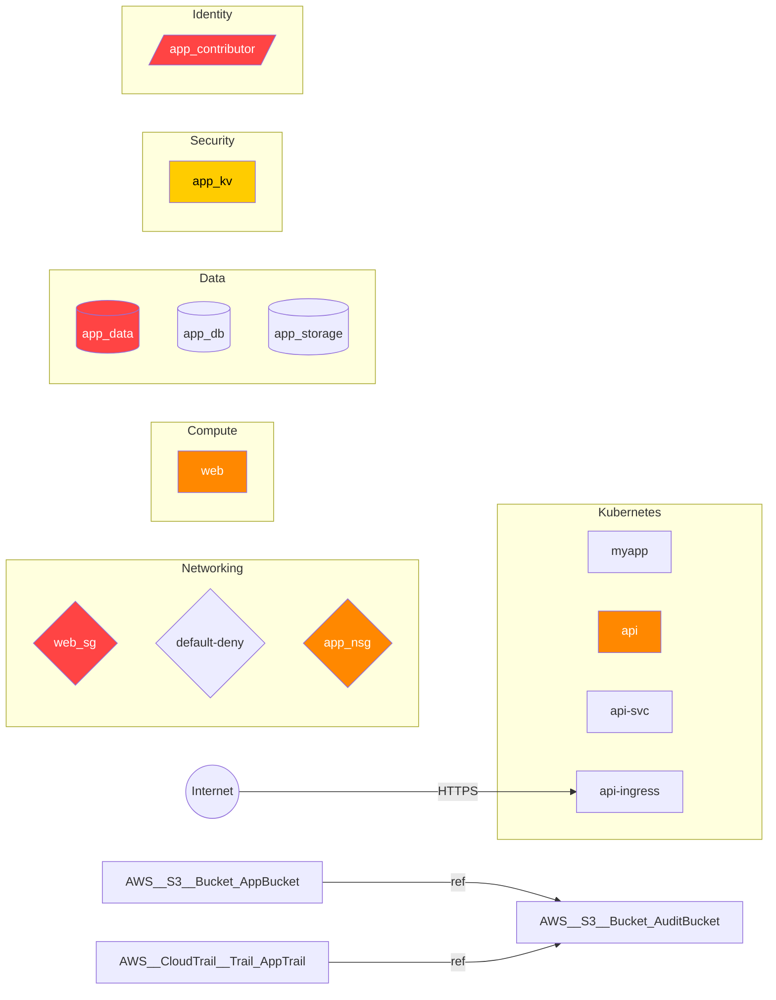

# threatmap

[](https://github.com/bogdanticu88/threatmap/actions/workflows/ci.yml)
[](https://pypi.org/project/threatmap/)
[](LICENSE)
[](https://github.com/bogdanticu88/threatmap)

Static IaC threat modeler that parses Terraform, CloudFormation, and Kubernetes manifests and produces a structured STRIDE threat model report with a data flow diagram. No network calls, no cloud credentials, fully offline.


---

## Quick Start

```bash
pip install -e .
threatmap scan ./examples --output report.md --fail-on HIGH
```

---

## Supported Formats and Providers

| Format | Provider | Extension |
|--------|----------|-----------|
| Terraform HCL | AWS, Azure, GCP | `.tf` |
| CloudFormation | AWS | `.yaml`, `.yml`, `.json` |
| Kubernetes manifests | Kubernetes | `.yaml`, `.yml` |

---

## Install

```bash
pip install -e .
```

Or from requirements:

```bash
pip install -r requirements.txt
pip install -e .
```

---

## Usage

Scan a directory and print a Markdown report to stdout:

```bash
threatmap scan ./terraform/
```

Scan multiple paths and write a JSON report to a file:

```bash
threatmap scan ./terraform/ ./k8s/ ./cloudformation/ --format json --output report.json
```

CI gate — exit code 1 if any CRITICAL or HIGH threat is found:

```bash
threatmap scan ./infra/ --fail-on HIGH --output threat-report.md
```

Print a terminal summary table only, without writing a full report:

```bash
threatmap scan ./infra/ --summary
```

---

## Sample Report Output

Running `threatmap scan ./examples --output report.md` against the bundled examples produces a full Markdown report. Below is a representative excerpt.

### STRIDE Threat Table

| ID | Severity | STRIDE Category | Resource | Description |
|----|----------|----------------|----------|-------------|
| T-001 | 🔴 CRITICAL | Information Disclosure | `AuditBucket` | S3 bucket 'AuditBucket' has no public access block configured — bucket may be publicly accessible. |
| T-002 | 🔴 CRITICAL | Spoofing | `WebSecurityGroup` | Security group 'WebSecurityGroup' exposes SSH/RDP (port 22/3389) to 0.0.0.0/0. |
| T-003 | 🔴 CRITICAL | Elevation of Privilege | `app_contributor` | Role assignment 'app_contributor' grants the privileged role 'Contributor'. |
| T-006 | 🟠 HIGH | Information Disclosure | `AuditBucket` | S3 bucket 'AuditBucket' does not have server-side encryption configured. |
| T-008 | 🟠 HIGH | Elevation of Privilege | `api` | Container 'api' in Deployment 'api' may run as root (no runAsNonRoot=true or runAsUser=0). |
| T-011 | 🟠 HIGH | Elevation of Privilege | `web` | EC2 instance 'web' allows IMDSv1 — metadata service accessible without session tokens, enabling SSRF-based credential theft. |

### Mitigation Detail (excerpt)

```
### T-002 — Spoofing (CRITICAL)

Resource:   AWS::EC2::SecurityGroup.WebSecurityGroup
Property:   ingress.ssh_rdp_open
Finding:    Security group 'WebSecurityGroup' exposes SSH/RDP (port 22/3389) to 0.0.0.0/0.
Mitigation: Remove public SSH/RDP access. Use AWS Systems Manager Session Manager
            or a bastion host with IP restrictions.
```

### Data Flow Diagram (Mermaid)

The report appends a Mermaid `flowchart LR` diagram. Nodes are coloured by worst-case severity (🔴 red = CRITICAL, 🟠 orange = HIGH). Paste the block into any Mermaid renderer or view it directly on GitHub.



---

## How the Rules Work

### Where rules live

Each cloud provider has its own analyzer module:

```
threatmap/analyzers/
├── aws.py         # 22 rules — S3, IAM, EC2, RDS, EKS, CloudTrail, KMS, Lambda
├── azure.py       # 19 rules — Storage, Key Vault, NSG, RBAC, AKS, ACR, SQL
├── gcp.py         # 15 rules — GCS, Firewall, Compute, Cloud SQL, GKE, IAM, KMS
└── kubernetes.py  # 17 rules — workloads, RBAC, network, secrets
```

Each rule is a function that receives a `Resource` object (normalised from whatever source format was parsed) and returns a `Threat` if the condition is met. Rules are plain Python conditionals — no DSL, no regex engine, no external ruleset files.

### How severities are assigned

Severity reflects both **exploitability** and **blast radius**:

| Severity | Meaning |
|----------|---------|
| CRITICAL | Directly exploitable with no additional preconditions (e.g. SSH open to 0.0.0.0/0, wildcard IAM policy, cluster-admin binding to anonymous) |
| HIGH | Significant risk requiring one additional step (e.g. unencrypted RDS with public access, IMDSv1 on an EC2 instance) |
| MEDIUM | Defence-in-depth controls missing — lower immediate risk but violates security baselines (e.g. no versioning, no logging, no resource limits) |
| LOW | Best-practice gaps with limited standalone exploitability (e.g. Lambda not in VPC) |

### How false positives are avoided

- **No heuristics or ML** — every rule fires on a concrete, unambiguous property value (e.g. `publicly_accessible = true`, `Principal: "*"`).
- **Conservative defaults** — if a property is absent, the rule assumes the insecure default (e.g. no `metadata_options` block on an EC2 instance means IMDSv1 is active, because that is AWS's default).
- **No cross-account or runtime state** — the tool only looks at what is declared in the template. It does not attempt to infer what SCPs, permission boundaries, or runtime configs might mitigate a finding.
- **Deduplication in the engine** — findings are keyed on `(stride_category, resource_name, trigger_property)` so the same logical issue is never reported twice even if it appears across multiple file formats.

---

## CI Integration

```yaml
# .github/workflows/threat-model.yml
name: Threat Model

on: [pull_request]

jobs:
  threatmap:
    runs-on: ubuntu-latest
    steps:
      - uses: actions/checkout@v4

      - name: Set up Python
        uses: actions/setup-python@v5
        with:
          python-version: "3.11"

      - name: Install threatmap
        run: pip install -r requirements.txt && pip install -e .

      - name: Run threat model scan
        run: |
          threatmap scan ./infra/ \
            --format markdown \
            --output threat-report.md \
            --fail-on HIGH

      - name: Upload threat report
        if: always()
        uses: actions/upload-artifact@v4
        with:
          name: threat-report
          path: threat-report.md
```

The `--fail-on HIGH` flag makes the job exit with code 1 if any HIGH or CRITICAL threat is found, blocking the PR merge. The uploaded artifact gives reviewers the full report without leaving the pull request.

---

## STRIDE Rule Coverage

| Provider | Rules |
|----------|-------|
| AWS (Terraform + CloudFormation) | 22 |
| Azure (Terraform) | 19 |
| GCP (Terraform) | 15 |
| Kubernetes | 17 |
| **Total** | **73** |

Categories covered per provider:

| Provider | S | T | R | I | D | E |
|----------|---|---|---|---|---|---|
| AWS | ✓ | ✓ | ✓ | ✓ | ✓ | ✓ |
| Azure | ✓ | ✓ | ✓ | ✓ | — | ✓ |
| GCP | ✓ | ✓ | ✓ | ✓ | — | ✓ |
| Kubernetes | ✓ | ✓ | — | ✓ | ✓ | ✓ |

*(S=Spoofing, T=Tampering, R=Repudiation, I=Information Disclosure, D=Denial of Service, E=Elevation of Privilege)*

---

## Development

Run tests:

```bash
pytest tests/ -v
```

Run with coverage:

```bash
pytest tests/ --cov=threatmap --cov-report=term-missing
```

---

## Contributing

1. Fork the repository
2. Add rules in `threatmap/analyzers/<provider>.py` following the existing pattern
3. Add a fixture in `tests/fixtures/` that triggers the new rule
4. Add assertions in `tests/test_analyzers.py`
5. Open a pull request
