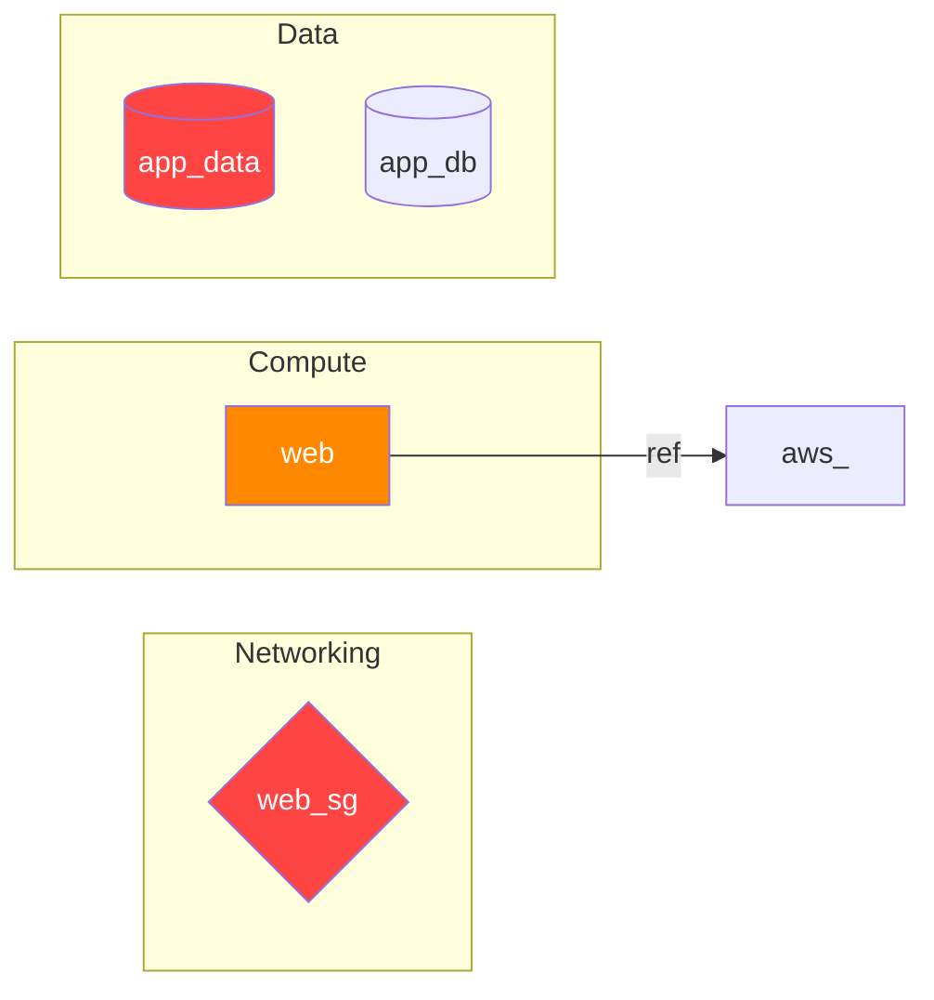

# Threat Model Report

**Generated:** 2026-02-26 19:08 UTC
**Source:** examples/terraform-aws/main.tf
**Tool:** threatmap v1.0.0

---

## Executive Summary

Analysis of **4 resources** across terraform identified **8 threats**:

- **CRITICAL**: 2
- **HIGH**: 3
- **MEDIUM**: 3
- **LOW**: 0
- **INFO**: 0

Immediate attention is required for CRITICAL and HIGH findings before this infrastructure is used in production.

---

## Resource Inventory

| # | Resource | Type | Provider | Format | Exposure |
|---|----------|------|----------|--------|----------|
| 1 | `app_data` | `aws_s3_bucket` | aws | terraform | unknown |
| 2 | `web_sg` | `aws_security_group` | aws | terraform | unknown |
| 3 | `web` | `aws_instance` | aws | terraform | unknown |
| 4 | `app_db` | `aws_db_instance` | aws | terraform | unknown |

---

## STRIDE Threat Analysis

| ID | Severity | STRIDE Category | Resource | Description |
|----|----------|----------------|----------|-------------|
| T-001 | [CRITICAL] | Information Disclosure | `app_data` | S3 bucket 'app_data' has no public access block configured — bucket may be publicly accessible. |
| T-002 | [CRITICAL] | Spoofing | `web_sg` | Security group 'web_sg' exposes SSH/RDP (port 22/3389) to 0.0.0.0/0. |
| T-003 | [HIGH] | Information Disclosure | `app_data` | S3 bucket 'app_data' does not have server-side encryption configured. |
| T-004 | [HIGH] | Elevation of Privilege | `web` | EC2 instance 'web' allows IMDSv1 — metadata service is accessible without session tokens, enabling SSRF-based credential theft. |
| T-005 | [HIGH] | Spoofing | `web_sg` | Security group 'web_sg' allows inbound traffic from 0.0.0.0/0. |
| T-006 | [MEDIUM] | Tampering | `app_data` | S3 bucket 'app_data' does not have versioning enabled — objects can be overwritten or deleted without recovery. |
| T-007 | [MEDIUM] | Repudiation | `app_data` | S3 bucket 'app_data' does not have access logging enabled — activity cannot be audited. |
| T-008 | [MEDIUM] | Information Disclosure | `web` | EC2 instance 'web' root EBS volume is not encrypted. |

---

## Mitigations

### T-001 — Information Disclosure (CRITICAL)

**Resource:** `aws_s3_bucket.app_data`
**Property:** `public_access_block`
**Finding:** S3 bucket 'app_data' has no public access block configured — bucket may be publicly accessible.

**Mitigation:** Enable S3 Block Public Access on the bucket and at the account level.

---

### T-002 — Spoofing (CRITICAL)

**Resource:** `aws_security_group.web_sg`
**Property:** `ingress.ssh_rdp_open`
**Finding:** Security group 'web_sg' exposes SSH/RDP (port 22/3389) to 0.0.0.0/0.

**Mitigation:** Remove public SSH/RDP access. Use AWS Systems Manager Session Manager or a bastion host with IP restrictions.

---

### T-003 — Information Disclosure (HIGH)

**Resource:** `aws_s3_bucket.app_data`
**Property:** `server_side_encryption_configuration`
**Finding:** S3 bucket 'app_data' does not have server-side encryption configured.

**Mitigation:** Add a server_side_encryption_configuration block using AES256 or aws:kms.

---

### T-004 — Elevation of Privilege (HIGH)

**Resource:** `aws_instance.web`
**Property:** `metadata_options.http_tokens`
**Finding:** EC2 instance 'web' allows IMDSv1 — metadata service is accessible without session tokens, enabling SSRF-based credential theft.

**Mitigation:** Set metadata_options { http_tokens = "required" } to enforce IMDSv2.

---

### T-005 — Spoofing (HIGH)

**Resource:** `aws_security_group.web_sg`
**Property:** `ingress.cidr_blocks`
**Finding:** Security group 'web_sg' allows inbound traffic from 0.0.0.0/0.

**Mitigation:** Restrict ingress rules to known CIDR ranges or security group references.

---

### T-006 — Tampering (MEDIUM)

**Resource:** `aws_s3_bucket.app_data`
**Property:** `versioning`
**Finding:** S3 bucket 'app_data' does not have versioning enabled — objects can be overwritten or deleted without recovery.

**Mitigation:** Enable versioning on the S3 bucket.

---

### T-007 — Repudiation (MEDIUM)

**Resource:** `aws_s3_bucket.app_data`
**Property:** `logging`
**Finding:** S3 bucket 'app_data' does not have access logging enabled — activity cannot be audited.

**Mitigation:** Enable S3 server access logging and direct logs to a dedicated audit bucket.

---

### T-008 — Information Disclosure (MEDIUM)

**Resource:** `aws_instance.web`
**Property:** `root_block_device.encrypted`
**Finding:** EC2 instance 'web' root EBS volume is not encrypted.

**Mitigation:** Set encrypted = true in the root_block_device block, or enable EBS encryption by default in the region.

---

## Data Flow Diagram

